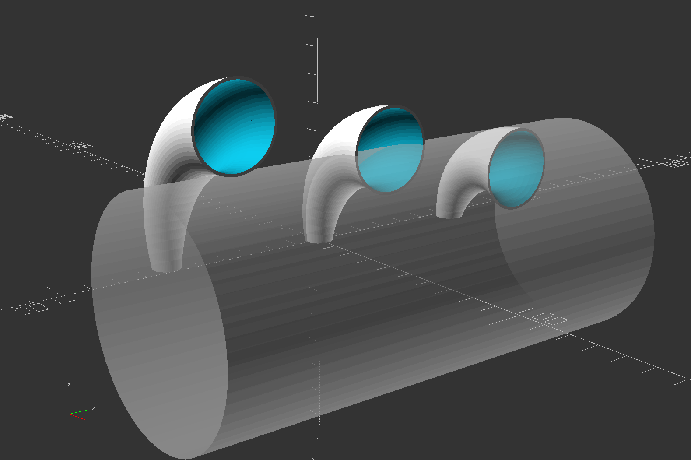
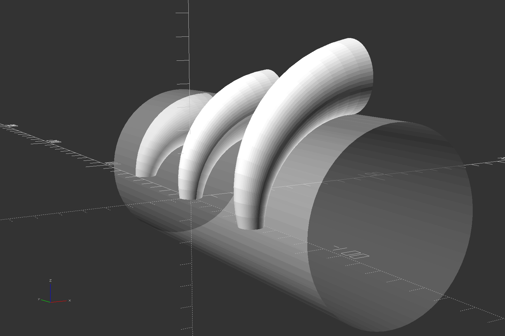
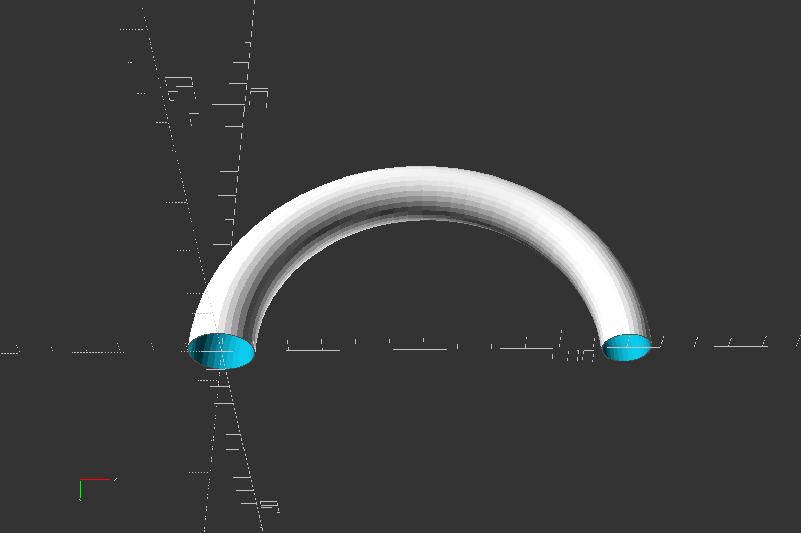

# bent_cone_scad
OpenSCAD module to create a bent cone

## bent_cone(r,a,d1,d2,w1,w2,p,fn)
Creates a curved cylinder or cone.  
Like cylinder() in that d1 and d2 describe two circles at the ends, and they may be different diameters to make a cone rather than a cylinder.  
but where the centers of the circles in cylinder() follow a straight line path described by height h,  
the centers of the circles in bent_cone() follow an arc path described by radius r and angle a.

r = main arc path radius (max(d1,d2)/2)  
a = main arc path angle (90)  
d1 = beginning outside diameter (10)  
d2 = ending outside diameter (d1)  
w1 = beginning wall thickness (0)  
w2 = ending wall thickness (w1)  
<ul>
0 = solid object 
>0 = hollow tube
</ul>

p = main arc path alignment relative to the body ("center")  
<ul>
"center" = the main arc defines the center of the tube 
"inside" = the main arc defines the concave/inside side of the tube (the tube hugs the outside of a cylinder) 
"outside" = the main arc defines the convex/outside side of the tube (the tube hugs the inside of a cylinder)
</ul>

fn = virtual $fn just for the main arc ($fn, else 36)
