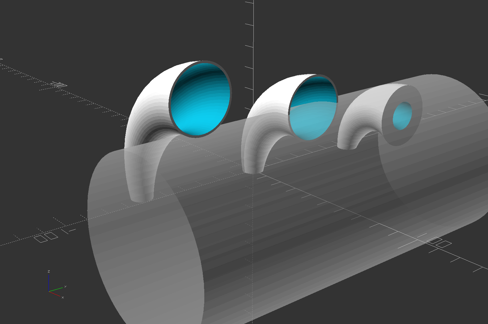

# bent_cone_scad
OpenSCAD module to create a bent cone

## bent_cone()
Creates a curved cylinder or cone.  
Like cylinder() in that d1 and d2 describe two circles at the ends, and they may be different diameters to make a cone rather than a cylinder.  
but where the centers of the circles in cylinder() follow a straight line path described by height h,  
the centers of the circles in bent_cone() follow an arc path described by radius r and angle a.

r = main arc path radius  
a = main arc path angle  
d1 = small end outside diameter  
d2 = large end outside diameter  
e1 = extend the small end with a normal cylinder this long  
e2 = extend the large end with a normal cylinder this long  
p = main arc path alignment relative to the body  
<ul>
"center" (default) = the main arc defines the center of the tube 
"inside" = the main arc defines the concave side of the tube (the tube hugs the outside of a cylinder) 
"outside" = the main arc defines the convex side of the tube (the tube hugs the inside of a cylinder)
</ul>

w1 = small end wall thickness  
w2 = large end wall thickness (default same as w1)  
<ul>
0 (default) = solid object 
>0 = hollow tube
</ul>
$fn = used to size the main arc segments the same as normal cylinders. If $fn is not set, 36 is used.
