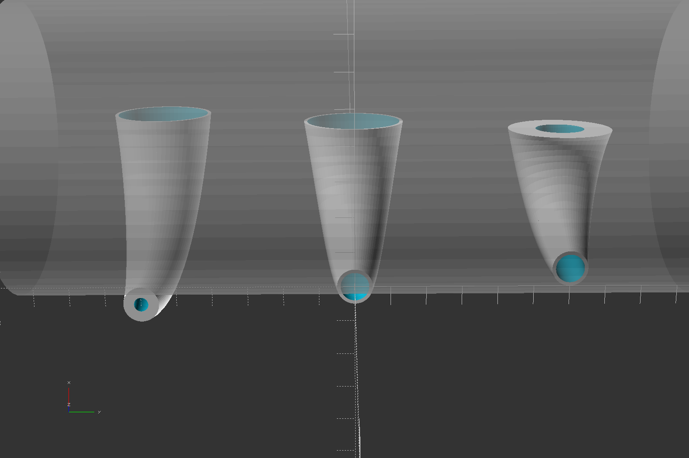

# bent_cone_scad
OpenSCAD module to create a bent cone

## arc_cylinder()  
Creates a curved cylinder or cone.  
Like cylinder() in that d1 and d2 describe two circles at the ends,  
but where the centers of the circles in cylinder() follow a straight line described by height h,  
the centers of the circles in arc_cylinder() follow the path of an arc described by radius r and angle a.

d1 = small-end diameter  
d2 = large-end diameter  
r = main arc radius  
a = main arc angle  
e1 = extend the small end with a normal cylinder this long  
e2 = extend the large end with a normal cylinder this long  
p = main arc path alignment relative to the body  
 "center" (default) = the main arc defines the center of the tube  
 "inside" = the main arc defines the concave side of the tube (the tube hugs the outside of a cylinder)  
 "outside" = the main arc defines the convex side of the tube (the tube hugs the inside of a cylinder)  
$fn = used to size the main arc segments the same as normal cylinders. If $fn is not set, 36 is used.

## arc_tube()  
Just arc_cylinder() with an added wall-thickness field to make a hollow arc_cylinder by subtracting a 2nd arc_cylinder that is wall-thickness smaller.

All the same parameters as arc_cylinder(), plus:  
w = wall thickness  
d1 & d2 are the outside diameter  
